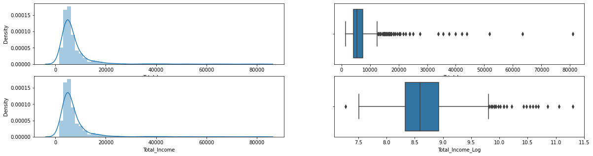

<div style="position: absolute; top: 0; right: 0;">
    <a href="ertugrulbusiness@gmail.com"></a>
    <a href="https://tr.linkedin.com/in/ertu%C4%9Fruldemir?original_referer=https%3A%2F%2Fwww.google.com%2F"></a>
    <a href="https://github.com/ertugruldmr"></a>
    <a href="https://www.kaggle.com/erturuldemir"></a>
    <a href="https://huggingface.co/ErtugrulDemir"></a>
    <a href="https://stackoverflow.com/users/21569249/ertu%c4%9frul-demir?tab=profile"></a>
    <a href="https://medium.com/@ertugrulbusiness"></a>
    <a href="https://www.youtube.com/channel/UCB0_UTu-zbIsoRBHgpsrlsA"></a>
</div>


# Iris Flowers Species Classification

## __Table Of Content__
- (A) [__Brief__](#brief)
  - [__Project__](#project)
  - [__Data__](#data)
  - [__Demo__](#demo) -> [Live Demo](https://ertugruldemir-customerloanapprovalclassification.hf.space)
  - [__Study__](#problemgoal-and-solving-approach)
  - [__Results__](#results)
- (B) [__Detailed__](#Details)
  - [__Abstract__](#abstract)
  - [__Explanation of the study__](#explanation-of-the-study)
    - [__(A) Dependencies__](#a-dependencies)
    - [__(B) Dataset__](#b-dataset)
    - [__(C) Pre-processing__](#c-pre-processing)
    - [__(D) Exploratory Data Analysis__](#d-exploratory-data-analysis)
    - [__(E) Modelling__](#e-modelling)
    - [__(F) Saving the project__](#f-saving-the-project)
    - [__(G) Deployment as web demo app__](#g-deployment-as-web-demo-app)
  - [__Licance__](#license)
  - [__Connection Links__](#connection-links)

## __Brief__ 

### __Project__ 
- This is a __binary classification__ project that uses the  [__Loan Prediction Problem Dataset__](https://www.kaggle.com/datasets/altruistdelhite04/loan-prediction-problem-dataset) from kaggle to __classify the species__ of customers based on 11 features to determinate the loan approval situation.
- __Goal__ is to build a model that accurately __predicts__ whether customers' loan application will be approved by the bank.
- The performance of the model is evaluated using several __metrics__, including _accuracy_, _precision_, _recall_, and _F1 score_.
#### __Overview__
- This project involves building a machine learning model to classify customers' loan application according previous decisions data of the bank. The dataset contains 614 records. There are 2 classes these are Yes (The loan approved) No (Not approved). The distributions of the target class are 68% Yes and 32% No. The project uses Python and several popular libraries such as Pandas, NumPy, and Scikit-learn.

#### __Demo__

<div align="left">
  <table>
    <tr>
    <td>
        <a target="_blank" href="https://ertugruldemir-customerloanapprovalclassification.hf.space">[Demo app] HF Space</a>
      </td>
      <td>
        <a target="_blank" href="https://colab.research.google.com/drive/1gwz33viKyZeuPDHwM44rcNHIyhjifd3Z#scrollTo=3zGq_05wOb4R">[Demo app] Run in Colab</a>
      </td>
      <td>
        <a target="_blank" href="https://github.com/ertugruldmr/CustomerLoanApprovalClassification/blob/main/study.ipynb">[Traning pipeline] source on GitHub</a>
      </td>
    <td>
        <a target="_blank" href="https://colab.research.google.com/drive/1PrzbpM2FFUA-Cudv9ULtzZ0-DoFqEHkb">[Traning pipeline] Run in Colab</a>
      </td>
    </tr>
  </table>
</div>


- Description
    - __Binary classification of the loan approvement__ of customer loan application into bank based on 11 features.
    - __Usage__: Set the feature values through sliding the radio buttons and selecting corresponding option from dropdown menu then use the button to predict.
- Embedded [Demo](https://ertugruldemir-customerloanapprovalclassification.hf.space) window from HuggingFace Space
    

<iframe
	src="https://ertugruldemir-customerloanapprovalclassification.hf.space"
	frameborder="0"
	width="850"
	height="450"
></iframe>

#### __Data__
- The [Loan Prediction Problem Dataset](https://www.kaggle.com/datasets/altruistdelhite04/loan-prediction-problem-dataset) from kaggle. If you want to download you can follow the recommended steps by kaggle or directly download by code where dataset section of my study.
- The dataset contains 5 numerical features, 6 categorical features and a target variable with 2 classes as binary (approved or not).
- The dataset contains the following features:
<table>
<tr><th>Data Info </th><th><div style="padding-left: 50px;">Stats</div></th></tr>

<tr><td>

```markdown
Variable | Description
----------|--------------
Loan_ID | Unique Loan ID
Gender | Male/ Female
Married | Applicant married (Y/N)
Dependents | Number of dependents
Education | Applicant Education (Graduate/ Under Graduate)
Self_Employed | Self employed (Y/N)
ApplicantIncome | Applicant income
CoapplicantIncome | Coapplicant income
LoanAmount | Loan amount in thousands
Loan_Amount_Term | Term of loan in months
Credit_History | credit history meets guidelines
Property_Area | Urban/ Semi Urban/ Rural
Loan_Status | Loan approved (Y/N)
```

</td><td>

<tr><td>

|    | Column             | Non-Null Count | Dtype   |
|---:|:------------------|---------------|--------|
|  0 | Loan_ID            | 614 non-null   | object |
|  1 | Gender             | 601 non-null   | object |
|  2 | Married            | 611 non-null   | object |
|  3 | Dependents         | 599 non-null   | object |
|  4 | Education          | 614 non-null   | object |
|  5 | Self_Employed      | 582 non-null   | object |
|  6 | ApplicantIncome    | 614 non-null   | int64  |
|  7 | CoapplicantIncome  | 614 non-null   | float64|
|  8 | LoanAmount         | 592 non-null   | float64|
|  9 | Loan_Amount_Term   | 600 non-null   | float64|
| 10 | Credit_History     | 564 non-null   | float64|
| 11 | Property_Area      | 614 non-null   | object |
| 12 | Loan_Status        | 614 non-null   | object |

</td><td>

<div style="flex: 50%; padding-left: 50px;">

|                 | Count | Mean       | Std        | Min | 25%   | 50%    | 75%    | Max     |
| --------------- | ----- | ---------- | ----------| --- | ----- | ------ | ------ | ------- |
| ApplicantIncome | 614   | 5403.4593  | 6109.0417 | 150 | 2877.5| 3812.5 | 5795.0 | 81000.0 |
| CoapplicantIncome | 614 | 1621.2458 | 2926.2484 | 0.0 | 0.0   | 1188.5 | 2297.25| 41667.0 |
| LoanAmount      | 592   | 146.4122   | 85.5873   | 9.0 | 100.0 | 128.0  | 168.0  | 700.0   |
| Loan_Amount_Term| 600   | 342.0000   | 65.1204   | 12.0| 360.0 | 360.0  | 360.0  | 480.0   |
| Credit_History  | 564   | 0.8422     | 0.3649    | 0.0 | 1.0   | 1.0    | 1.0    | 1.0     |

</div>

</td></tr> </table>

<div style="text-align: center;">
    
</div>

#### __Problem,Goal and Solving approach__
- __The problem__ is a classification problem. __classify the species__ of iris flowers based on four features.
- The __goal__ is to build a model that accurately __predicts the species__ of a new iris based on these features.

- __Solving approach__ is that using the supervised machine learning models (linear, non-linear, ensemly) on the dataset through convenient processes.

#### __Study__
The project aimed classifying the species using the features. The study includes following chapters.
- __(A) Dependencies__: Installations and imports of the libraries.
- __(B) Dataset__: Downloading and loading the dataset via kaggle api. (YOu need acces token of your kaggle account. The process had handled the code just follow the instructions on the chapter)
- __(C) Pre-processing__: It includes data type casting, feature engineering, missing value hadnling, outlier handling.
- __(D) Exploratory Data Analysis__: Univariate, Bivariate, Multivariate anaylsises. Correlation and other relations.
- __(E) Modelling__: Model tuning via GridSearch on classic mechine learning. These are Linear, Non-linear, Ensemble Models. 
- __(F) Saving the project__: Saving the project and demo studies.
- __(G) Deployment as web demo app__: Creating Gradio Web app to Demostrate the project.Then Serving the demo via huggingface as live.

#### __results__
- The final model is __logistic regression__ because of the results and less complexity.
    -  So we can classify the species with %97 accuracy, precision, recall, f1_score.
<div style="flex: 50%; padding-left: 80px;">

|   | accuracy | precision | recall | f1_score |
|---|---------|-----------|--------|----------|
| lgbm | 0.813008 | 0.813008 | 0.813008 | 0.813008 |
</div> 

- Model tuning results are below.

<table>
<tr><th>Linear Model Tuning Results</th></tr>
<tc><td>


|      Model     | MaxError | MeanAbsoluteError | MeanAbsolutePercentageError | MSE     | RMSE    | MAE     | R2       | ExplainedVariance |
|:--------------:|---------|------------------|------------------------------|---------|---------|---------|----------|-------------------|
|    lin_reg     | 0.227609| 0.170732         | 0.170732                     | 1.0     | 0.0     | inf     | 0.130303 | 0.413197          |
|    l1_reg      | 1.0     | 0.0              | inf                          | 0.170732| 0.413197| 0.170732| 0.130303 | 0.227609          |
|    l2_reg      | 0.0     | 0.0              | inf                          | 0.268293| 0.517970| 0.268293| -0.366667| 0.0               |
|    enet_reg    | 1.0     | 0.0              | inf                          | 0.170732| 0.413197| 0.170732| 0.130303 | 0.227609          |


</td><td> </table>


<table>
<tr><th>Non-Linear Model Tuning Results</th><th><div style="padding-left: 175px;">Ensemble Model Tuning Results</div></th></tr>

<tr><td>

|   Model | accuracy | precision | recall   | f1_score |
|---------|----------|-----------|----------|----------|
| loj_reg | 0.829268 | 0.829268  | 0.829268 | 0.829268 |
| nb_params | 0.829268 | 0.829268  | 0.829268 | 0.829268 |
| knn     | 0.772358 | 0.772358  | 0.772358 | 0.772358 |
| svc     | 0.829268 | 0.829268  | 0.829268 | 0.829268 |
| dt      | 0.796748 | 0.796748  | 0.796748 | 0.796748 |


</td><td>
<div style="flex: 50%; padding-left: 175px;">


| Model | Accuracy | Precision | Recall | F1 Score |
|-------|----------|-----------|--------|----------|
| rf | 0.821138 | 0.821138 | 0.821138 | 0.821138 |
| gbc | 0.821138 | 0.821138 | 0.821138 | 0.821138 |
| xgbc | 0.780488 | 0.780488 | 0.780488 | 0.780488 |
| lgbm | 0.813008 | 0.813008 | 0.813008 | 0.813008 |
| cb | 0.829268 | 0.829268 | 0.829268 | 0.829268 |


</div>

</td></tr> </table>


## Details

### Abstract
- [Loan Prediction Problem Dataset](https://www.kaggle.com/datasets/altruistdelhite04/loan-prediction-problem-dataset) is used to classifying loan applyment on a bank. The dataset has 614 records and a binary class as yes (the loan is approved) or no (the loan is not approved). The dataset has 12 attributes but used 11 features on them model. The problem is supervised learning task as Binary classification problem. The goal is the predicting the custemers' loan applyment correctly through using supervised machine learning algorithms such as non-linear, ensemble and smilar classic machine learning model.The study includes creating the environment, getting the data, preprocessing the data, exploring the data, modelling the data, saving the results, deployment as demo app. Training phase of the models implemented through cross validation and Grid Search model tuning approachs. Hyperparameter tuning implemented Greedy Greed Search approach which tunes a hyper param at once a time while iterating the sorted order according the importance of the hyperparams. Models are evaluated with corss validation methods using 5 split. Classification results collected and compared between the models. Selected the basic and more accurated model which is the Decision Tree. Tuned Decision Tree  model has %81 accuracy, precision, recall, f1_score, the other metrics are also found the results section such as feature importance. End of the study created a demo and served has 

- Project File structure
  ``` bash
    ├── demo_app
    │   ├── app.py
    │   ├── cat_encods.json
    │   ├── component_configs.json
    │   ├── lgbm_model.sav
    │   └── requirements.txt
    ├── docs
    │   └── images
    ├── env
    │   ├── env_installation.md
    │   └── requirements.txt
    ├── LICENSE.txt
    ├── readme.md
    └── study.ipynb
  ```
- Description of the files
  - demo_app/
    - Includes the demo web app files, it has the all the requirements in the folder so it can serve on anywhere.
    - demo_app/app.py:
      - Implementation code of the demo web app.
    - demo_app/cat_encods.json:
      - Encoding the features for prepration of the data into model.
    - demo_app/component_configs.json :
      - It includes the web components to generate web page.
    - demo_app/decision_tree_model.sav:
      - The trained (Model Tuned) model as Decision Tree model instance from sklearn library.
  - docs/
    - Includes the documents about results and presentations
  - env/
    - It includes the training environmet related files. these are required when you run the study.ipynb file.
  - LICENSE.txt
    - It is the pure apache 2.0 licence. It isn't edited.
  - readme.md
    - It includes all the explanations about the project
  - study.ipynb
    - It is all the studies about solving the problem which reason of the dataset existance.    

    
### Explanation of the Study
####  __(A) Dependencies__:
  -  There is an additioanl installation instead of environment, it jus kaggle dataset api for getting the dataset, follow the instruction on the dataset chapter of the study.ipynb. The libraries which already installed on the environment are enough. You can create an environment via env/requirements.txt. Create a virtual environment then use following code. It is enough to satisfy the requirements for runing the study.ipynb which training pipeline.
#### __(B) Dataset__: 
  - Downloading an [Prediction Problem Dataset](https://www.kaggle.com/datasets/altruistdelhite04/loan-prediction-problem-dataset) via kaggle api as file. The dataset has 614 records. Each target class has 50 records. There are 12 attributes but used 11 features on the model. 6 features are categorical type and the other 5 features are numerical type.The target variables has 2 classes as binary, these are yes (the loan apploymeny is approved) or no (not approved). for more info such as histograms and etc... you can look the '(D) Exploratory Data Analysis' chapter.
#### __(C) Pre-processing__: 
  - The processes are below:
    - Preparing the dtypes such as casting the object type to categorical type.
    - Feature engineering for creating new variables and logaritmic transformation of the features to get normal distribution.
        <div style="text-align: center;">
          
          
          
          
          
      </div>
    - The missing values imputed with mean and mode of the corresponding values. The other imputation aproachs (predictive imputation etc...) are not implemented because of the missing value ratio lowerance. But the other approaches are added as options for further study.
      <div style="text-align: center;">
          
          
          
      </div>
    - Outlier analysis using the both visual and IQR calculation apporachs. According to IQR approach the outlier ratio is not above 0.05 so no handling process implemented instead of logaritmic transformation.
      <div style="text-align: center;">
          
      </div>

#### __(D) Exploratory Data Analysis__:
  - Dataset Stats

```markdown
Variable | Description
----------|--------------
Loan_ID | Unique Loan ID
Gender | Male/ Female
Married | Applicant married (Y/N)
Dependents | Number of dependents
Education | Applicant Education (Graduate/ Under Graduate)
Self_Employed | Self employed (Y/N)
ApplicantIncome | Applicant income
CoapplicantIncome | Coapplicant income
LoanAmount | Loan amount in thousands
Loan_Amount_Term | Term of loan in months
Credit_History | credit history meets guidelines
Property_Area | Urban/ Semi Urban/ Rural
Loan_Status | Loan approved (Y/N)
```
<table>
<tr><th>Data Info </th><th><div style="padding-left: 50px;">Stats</div></th></tr>

<tr><td>

|    | Column             | Non-Null Count | Dtype   |
|---:|:------------------|---------------|--------|
|  0 | Loan_ID            | 614 non-null   | object |
|  1 | Gender             | 601 non-null   | object |
|  2 | Married            | 611 non-null   | object |
|  3 | Dependents         | 599 non-null   | object |
|  4 | Education          | 614 non-null   | object |
|  5 | Self_Employed      | 582 non-null   | object |
|  6 | ApplicantIncome    | 614 non-null   | int64  |
|  7 | CoapplicantIncome  | 614 non-null   | float64|
|  8 | LoanAmount         | 592 non-null   | float64|
|  9 | Loan_Amount_Term   | 600 non-null   | float64|
| 10 | Credit_History     | 564 non-null   | float64|
| 11 | Property_Area      | 614 non-null   | object |
| 12 | Loan_Status        | 614 non-null   | object |

</td><td>

<div style="flex: 50%; padding-left: 50px;">

|                 | Count | Mean       | Std        | Min | 25%   | 50%    | 75%    | Max     |
| --------------- | ----- | ---------- | ----------| --- | ----- | ------ | ------ | ------- |
| ApplicantIncome | 614   | 5403.4593  | 6109.0417 | 150 | 2877.5| 3812.5 | 5795.0 | 81000.0 |
| CoapplicantIncome | 614 | 1621.2458 | 2926.2484 | 0.0 | 0.0   | 1188.5 | 2297.25| 41667.0 |
| LoanAmount      | 592   | 146.4122   | 85.5873   | 9.0 | 100.0 | 128.0  | 168.0  | 700.0   |
| Loan_Amount_Term| 600   | 342.0000   | 65.1204   | 12.0| 360.0 | 360.0  | 360.0  | 480.0   |
| Credit_History  | 564   | 0.8422     | 0.3649    | 0.0 | 1.0   | 1.0    | 1.0    | 1.0     |

</div>

</td></tr> </table>

  </td></tr> </table>
  - Target Distribuutions
      <div style="text-align: center;">
          
      </div>
  - Variable Analysis
    - Univariate analysis, 
      <div style="text-align: center;">
          
          
          
          
      </div>
    - Bivariate analysis
      <div style="text-align: center;">
          
          
          
          
      </div>
    - Multivariate analysis.
      <div style="text-align: center;">
          
          
          
      </div>
  - Other relations.
    <div style="display:flex; justify-content: center; align-items:center;">
      <div style="text-align: center;">
      <figure>
      <p>Correlation Map</p>
      
      </figure>
      </div>
      <div style="text-align: center;">
      <p>Correlation Between Features and Target Variable</p>
      <figure>
      
      </figure>
      </div>
      <div style="text-align: center;">
      <p>Variance Between Features and Target Variable</p>
      <figure>
      
      </figure>
      </div>
      <div style="text-align: center;">
      <p>CoVariance Between Features and Target Variable</p>
      <figure>
      
      </figure>
      </div>
    </div>

#### __(E) Modelling__: 
  - Data Split
    - Splitting the dataset via  sklearn.model_selection.train_test_split (test_size = 0.2).
  - Util Functions
    - Greedy Step Tune
      - It is a custom tuning approach created by me. It tunes just a hyperparameter per step using through GridSerchCV. It assumes the params ordered by importance so it reduces the computation and time consumption.  
    - Model Tuner
      - It is an abstraction of the whole training process. It aims to reduce the code complexity. It includes the corss validation and GridSerachCV approachs to implement training process.
    - Learning Curve Plotter
      - Plots the learning curve of the already trained models to provide insight.
  - Linear Models
    - linear, l1, l2, enet regressions
    - Cross Validation Scores
      |              | MaxError | MeanAbsoluteError | MeanAbsolutePercentageError | MSE      | RMSE     | MAE      | R2        | ExplainedVariance |
      | ------------ | --------| ----------------- | --------------------------- | -------- | -------- | -------- | --------- | ----------------- |
      | lin_reg      | 0.227609| 0.170732          | 0.170732                    | 1.0      | 0.0      | inf      | 0.130303  | 0.413197          |
      | l1_reg       | 1.0     | 0.0               | inf                         | 0.170732 | 0.413197 | 0.170732 | 0.130303  | 0.227609          |
      | l2_reg       | 0.0     | 0.0               | inf                         | 0.268293 | 0.517970 | 0.268293 | -0.366667 | 0.0               |
      | enet_reg     | 1.0     | 0.0               | inf                         | 0.170732 | 0.413197 | 0.170732 | 0.130303  | 0.227609          |
    - Feature Importances
      <div style="display:flex; justify-content: center; align-items:center;">
        <div style="text-align: center;">
          <figure>
          
          </figure>
          </div>
          <div style="text-align: center;">
          <figure>
          
          </figure>
      </div>

    - Learning Curves
      <div style="display:flex; justify-content: center; align-items:center;">
        <div style="text-align: center;">
          <figure>
          
          </figure>
          </div>
          <div style="text-align: center;">
          <figure>
          
          </figure>
      </div>

  - Non-Linear Models
    - Logistic Regression, Naive Bayes, K-Nearest Neighbors, Support Vector Machines, Decision Tree
    - Cross Validation Scores
    |         | Accuracy | Precision | Recall | F1 Score |
    |---------|---------|-----------|--------|----------|
    | loj_reg | 0.829268 | 0.829268  | 0.829268 | 0.829268 |
    | nb_params | 0.829268 | 0.829268 | 0.829268 | 0.829268 |
    | knn | 0.772358 | 0.772358 | 0.772358 | 0.772358 |
    | svc | 0.829268 | 0.829268 | 0.829268 | 0.829268 |
    | dt | 0.796748 | 0.796748 | 0.796748 | 0.796748 |

    - Feature Importances
      <div style="display:flex; justify-content: center; align-items:center;">
          
      </div>

    - Learning Curves
      <div style="display:flex; justify-content: center; align-items:center;">
          
      </div>

  - Ensemble Models
    - Random Forest, Gradient Boosting Machines, XGBoost, LightGBoost, CatBoost
    - Cross Validation Scores
      |          | accuracy | precision | recall   | f1_score |
      |----------|----------|-----------|----------|----------|
      | rf       | 0.821138 | 0.821138  | 0.821138 | 0.821138 |
      | gbc      | 0.821138 | 0.821138  | 0.821138 | 0.821138 |
      | xgbc     | 0.780488 | 0.780488  | 0.780488 | 0.780488 |
      | lgbm     | 0.813008 | 0.813008  | 0.813008 | 0.813008 |
      | cb       | 0.829268 | 0.829268  | 0.829268 | 0.829268 |

    - Feature Importances
      <div style="display:flex; justify-content: center; align-items:center;">
        
      </div>

    - Learning Curves
      <div style="display:flex; justify-content: center; align-items:center;">
          
      </div>


#### __(F) Saving the project__: 
  - Saving the project and demo studies.
    - trained model lgbm_model.sav as pickle format.
#### __(G) Deployment as web demo app__: 
  - Creating Gradio Web app to Demostrate the project.Then Serving the demo via huggingface as live.
  - Desciption
    - Project goal is classify the costumers' loan applyments inot yes (approved) or no (not approved) based on 11 feeatures which are 6 categorical 5 numerical feature.
    - Usage: Set the feature values through sliding the radio buttons and dropdown menu  then use the button to predict.
  - Demo
    - The demo app in the demo_app folder as an individual project. All the requirements and dependencies are in there. You can run it anywhere if you install the requirements.txt and kaggle dataset api.
    - You can find the live demo as huggingface space in this [demo link](https://ertugruldemir-customerloanapprovalclassification.hf.space) as full web page or you can also us the [embedded demo widget](#demo)  in this document.  
    
## License
- This project is licensed under the Apache 2.0 License. See the [LICENSE](LICENSE.txt) file for details.

<h1 style="text-align: center;">Connection Links</h1>

<div style="text-align: center;">
    <a href="ertugrulbusiness@gmail.com"></a>
    <a href="https://tr.linkedin.com/in/ertu%C4%9Fruldemir?original_referer=https%3A%2F%2Fwww.google.com%2F"></a>
    <a href="https://github.com/ertugruldmr"></a>
    <a href="https://www.kaggle.com/erturuldemir"></a>
    <a href="https://huggingface.co/ErtugrulDemir"></a>
    <a href="https://stackoverflow.com/users/21569249/ertu%c4%9frul-demir?tab=profile"></a>
    <a href="https://www.hackerrank.com/ertugrulbusiness"></a>
    <a href="https://app.patika.dev/ertugruldmr"></a>
    <a href="https://medium.com/@ertugrulbusiness"></a>
    <a href="https://www.youtube.com/channel/UCB0_UTu-zbIsoRBHgpsrlsA"></a>
</div>

